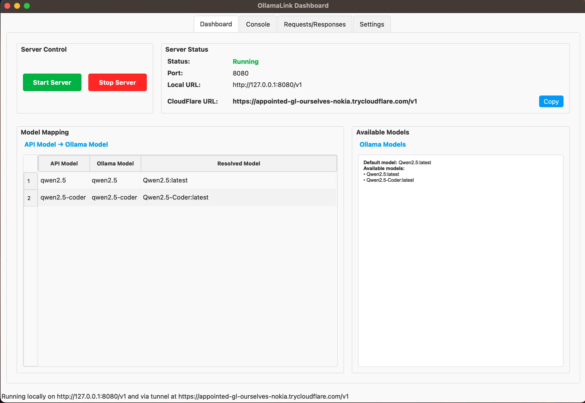
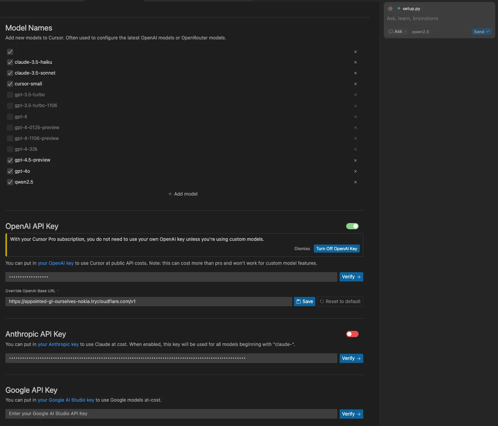
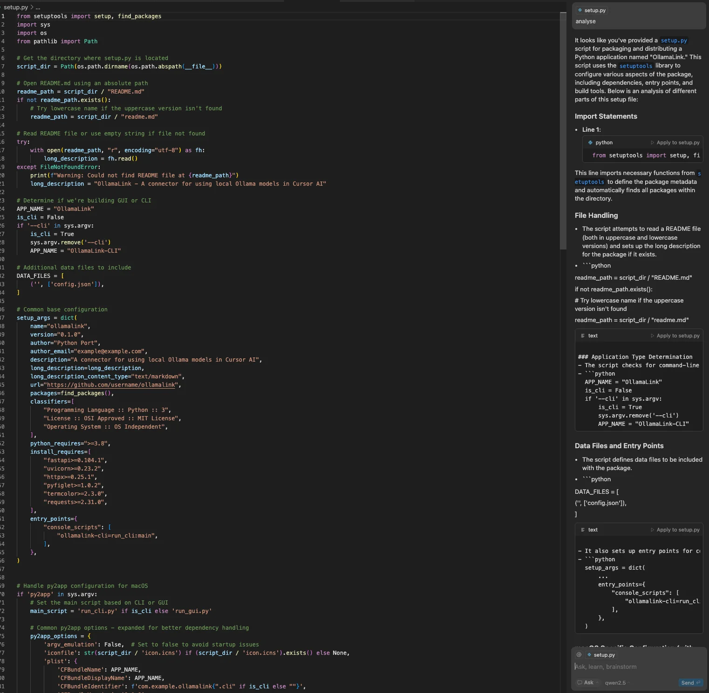
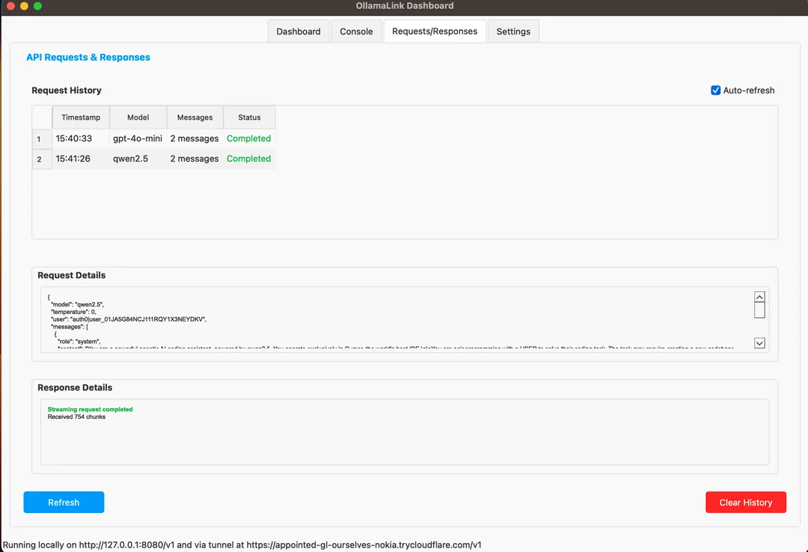

# OllamaLink

**Connect Cursor AI to your local Ollama models**



OllamaLink is a simple proxy that connects Cursor AI to your local Ollama models. It comes in both GUI and CLI versions, offering flexibility in how you want to manage your Ollama connections.

## Features



- **Simple**: Minimal setup, just run and go
- **Private**: Your code stays on your machine
- **Flexible**: Use any Ollama model with Cursor
- **Tunnel**: Works with Cursor's cloud service via CloudFlare tunnel
- **GUI & CLI**: Choose between graphical or command-line interface
- **Model Mapping**: Map commercial model names to your local Ollama models
- **Real-time Monitoring**: Track requests and responses in the GUI
- **Secure**: Optional API key support for added security

## Quick Start

1. **Install Ollama**:
   Ensure you have [Ollama](https://ollama.ai/) installed and running:
   ```sh
   ollama serve
   ```

2. **Install Requirements**:
   Install the necessary dependencies using pip:
   ```sh
   pip install -r requirements.txt
   ```

3. **Run OllamaLink**:
   Choose your preferred interface:

   **GUI Version**:
   ```sh
   python run_gui.py
   ```
   
   **CLI Version**:
   ```sh
   python run_cli.py
   ```

## Setting Up Cursor

### 1. Install Cursor

First, download and install Cursor from the official website: [https://cursor.sh](https://cursor.sh)

### 2. Get the OllamaLink URL

When you start OllamaLink, you'll get two types of URLs:

1. **Local URL**: `http://localhost:8080/v1` (default)
2. **CloudFlare Tunnel URL**: A public URL like `https://your-tunnel.trycloudflare.com/v1`

Choose the appropriate URL based on your needs:
- Use the **Local URL** if running Cursor on the same machine and port forwarding at router
- Use the **CloudFlare Tunnel URL** if you want to access your models from anywhere (reccomended)

### 3. Configure Cursor Settings



1. Open Cursor and access settings:
   - On macOS: Press `⌘ + ,` (Command + Comma)
   - On Windows/Linux: Press `Ctrl + ,`
   - Or click on the gear icon in the bottom left corner

2. Navigate to the "Models" tab in settings

3. Configure the following settings:
   - Find "Override OpenAI Base URL" below point OpenAI API Key
   - Paste your OllamaLink URL (either local or tunnel URL) and press save
   - Make sure to include the `/v1` at the end of the URL
   - Past API Key if specified in config.json or let it empty
   - Press Verify behind key input and it should automatically detect and start

4. Select a Model:
   Ensure the mapped models are availiable in cursor. 
   - If not add them e.g. qwen2.5": "qwen2.5" in config you need to daa qwen2.5 as model in cursor

   The actual Ollama model used depends on your `config.json` mappings.

5. Test the Connection:
   - Click the "Test Connection" button
   - You should see a success message
   - If you get an error, check the troubleshooting section below

### Common Setup Issues



1. **URL Error**:
   - Make sure the URL ends with `/v1`
   - Check if OllamaLink is running
   - Try the local URL if tunnel isn't working

2. **Model Not Found**:
   - Ensure you've selected one of the supported model names
   - Check your model mappings in `config.json`
   - Verify your Ollama models with `ollama list`

3. **Connection Failed**:
   - Verify Ollama is running with `ollama serve`
   - Check OllamaLink logs for errors
   - Try restarting both OllamaLink and Cursor

4. **Tunnel Issues**:
   - Ensure CloudFlare tunnel is enabled in settings
   - Check if CloudFlare daemon is installed
   - Try using the local URL instead

## Configuration

You can customize OllamaLink using a `config.json` file in the project root:

```json
{
    "openai": {
        "api_key": "sk-proj-1234567890",
        "endpoint": "https://api.openai.com"
    },
    "ollama": {
        "endpoint": "http://localhost:11434",
        "model_mappings": {
            "gpt-4o": "qwen2",
            "gpt-3.5-turbo": "llama3", 
            "claude-3-opus": "wizardcoder",
            "default": "qwen2.5-coder"
        }
    },
    "server": {
        "port": 8080,
        "hostname": "127.0.0.1"
    },
    "cloudflared": {
        "use_tunnel": true
    }
}
```

## GUI Features

The graphical interface provides:

- **Dashboard**: View server status and model mappings
- **Console**: Real-time server logs and events
- **Requests/Responses**: Monitor API traffic
- **Settings**: Configure server and model mappings

## CLI Usage

```sh
python run_cli.py [options]
```

### Options:
- `--port PORT`: Port to run on (default from config.json or 8080)
- `--direct`: Direct mode without tunnel
- `--ollama URL`: Ollama API URL (default from config.json or http://localhost:11434)
- `--host HOST`: Host to bind to (default from config.json or 127.0.0.1)
- `--tunnel`: Use cloudflared tunnel (default: on)
- `--no-tunnel`: Disable cloudflared tunnel

## Model Mapping

OllamaLink provides flexible model mapping that allows you to route requests for commercial models (like GPT-4 or Claude) to your locally running Ollama models.

### How Model Mapping Works

1. **Direct Mapping**: Each entry maps a client model name to a local model pattern.
   
   For example, when a client requests `gpt-4o`, OllamaLink will:
   - Look for a model that exactly matches "qwen2"
   - If not found, look for a model that contains "qwen2" in its name
   - If still not found, fall back to the default model

2. **Default Model**: The `default` entry specifies which model to use when no appropriate mapping is found.

3. **Fuzzy Matching**: The router performs fuzzy matching, so "qwen2" will match models like "qwen2.5-coder:latest", "qwen2-7b-instruct", etc.

## Building Executables

### macOS App Bundle

Build using py2app:

```sh
# GUI Version
python setup.py py2app

# CLI Version
python setup.py py2app --cli
```

### Windows Executable

Build using PyInstaller:

```sh
# GUI Version
pyinstaller --name OllamaLink-GUI --onefile --windowed --icon=icon.ico --add-data "config.json;." run_gui.py

# CLI Version
pyinstaller --name OllamaLink-CLI --onefile --console --icon=icon.ico --add-data "config.json;." run_cli.py
```

## Troubleshooting

### Cannot Connect to Ollama

If OllamaLink starts but shows an error connecting to Ollama:

1. **Check if Ollama is Running**:
   ```sh
   ollama serve
   ```

2. **Verify API Access**:
   Open your browser to: `http://localhost:11434/api/tags`
   You should see a JSON response with your models.

3. **Ensure at Least One Model is Installed**:
   ```sh
   ollama list
   ```
   If no models are shown, install one:
   ```sh
   ollama pull qwen2.5-coder
   ```

4. **Connection Issues**:
   - Check your firewall settings if using a remote Ollama server
   - Verify the Ollama endpoint in config.json if you changed it from default

### "No completion was generated after max retries"

If you encounter this error in Cursor:
```
We encountered an issue when using your API key: No completion was generated after max retries
API Error: Unknown error
(Request ID: xxxx-xxxx-xxxx-xxxx)
```

Try these steps:
1. **Ensure Ollama Models**:
   Make sure at least one model is loaded in Ollama:
   ```sh
   ollama list
   ```
   If no models are listed, run: `ollama pull qwen2.5-coder`

2. **Restart OllamaLink**:
   ```sh
   python run.py
   ```

3. **Update Cursor Model Selection**:
   In Cursor, make sure you're using mapped model names

## License

MIT
